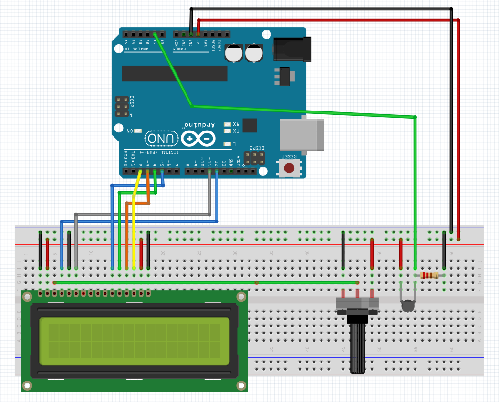

# Projeto: Medidor de Temperatura com Termistor

Este projeto consiste em um sistema de medição de temperatura utilizando um **termistor** como sensor principal. A leitura da temperatura é realizada através de uma interpolação linear, baseada em dados fornecidos pelo fabricante do termistor. Isso garante maior precisão ao considerar as características reais da curva de resposta do termistor. O resultado é exibido em um display LCD e também enviado ao Serial Monitor para monitoramento.

---

## 📜 **Descrição do Projeto**
O projeto utiliza um termistor conectado a uma entrada analógica do Arduino. A tensão medida no divisor resistivo do termistor é convertida para uma temperatura real com base em uma tabela de valores calibrada (curva característica fornecida pelo fabricante). A interpolação linear é usada para encontrar a temperatura correspondente à tensão medida.

### Componentes do Sistema:
- **Arduino Uno (ou equivalente)**  
- **Termistor** (como sensor de temperatura)  
- **Display LCD 16x2** (para exibição da temperatura)  
- **Resistores** (para formar o divisor de tensão com o termistor)  
- **Fios de conexão e protoboard**  

---

## ⚙️ **Funcionamento**

1. **Leitura do Sensor**:  
   O termistor é conectado a um divisor de tensão, cujo valor é lido pela porta analógica do Arduino (A0). 

2. **Conversão de Tensão**:  
   A leitura analógica (0-1023) é convertida para um valor de tensão real (0-5V).

3. **Interpolação Linear**:  
   - Os dados da curva característica do termistor são armazenados em dois vetores:
     - `x_vals`: Temperaturas correspondentes.
     - `y_vals`: Tensões medidas para cada temperatura.
   - A função `interpolar()` realiza a interpolação linear entre os pontos conhecidos para calcular a temperatura com maior precisão.

4. **Exibição dos Dados**:  
   A temperatura calculada é exibida:
   - No **display LCD** (em graus Celsius).  
   - No **Serial Monitor** (para depuração ou registros).

---

## 🛠️ **Montagem do Circuito**
1. Conecte o termistor e um resistor fixo em série para formar um divisor de tensão.  
   - Um terminal do divisor deve ir ao pino analógico A0 do Arduino.
   - O outro terminal deve ser conectado ao GND.  
   - A tensão de alimentação (5V) deve ser fornecida ao divisor.
   
2. Conecte o display LCD aos pinos digitais configurados no código (`12, 11, 5, 4, 3, 2`).



---

## 📋 **Código Principal**
O código é composto pelas seguintes partes principais:
1. Configuração do **display LCD** e do pino do sensor.
2. Leitura da tensão do divisor de tensão.
3. Interpolação linear para calcular a temperatura.
4. Exibição da temperatura no LCD e envio ao Serial Monitor.

### Função de Interpolação
A interpolação linear é realizada pela função `interpolar()`:
```cpp
float interpolar(float x) {
  for (int i = 0; i < N - 1; i++) {
    if (x >= y_vals[i+1] && x <= y_vals[i]) {
      return x_vals[i] + (x_vals[i + 1] - x_vals[i]) * ((x - y_vals[i+1]) / (y_vals[i] - y_vals[i+1]));
    }
  }
  return 0;
}
```
Essa função verifica em qual intervalo a tensão medida está e estima a temperatura correspondente.

---

## 🖥️ **Execução**
1. **Conecte o circuito** conforme descrito na seção de montagem.
2. **Carregue o código no Arduino** usando o Arduino IDE.
3. Abra o **Serial Monitor** para verificar as leituras em tempo real.
4. Acompanhe a temperatura exibida no display LCD.
